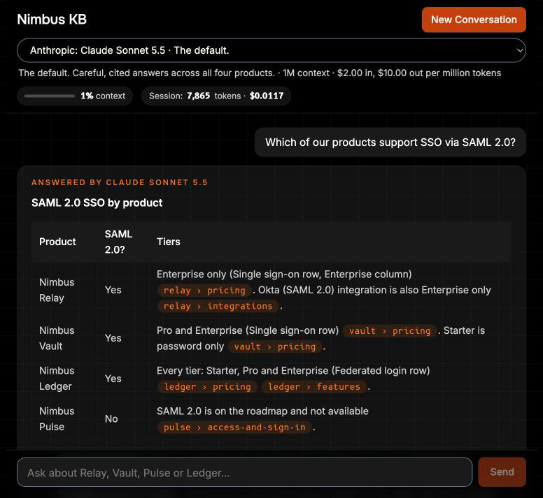

# Nimbus KB

> *Answers about NimbusStack's products, taken only from its own documents, with the sources one click away.*

<p align="center">
  
  
  
  
</p>

**Try it:** https://nimbus.ujjaval.ca (password protected: any username works, e.g. `demo`; only the password is checked, and it comes with the submission)

The live site answers with Claude Sonnet 5.5, with Gemini 3.5 Flash-Lite as the backup. Each visitor gets 25 model answers a day, enough for the six sample questions, the edge cases and follow-ups, and the whole site gets 300 a day. After that, answers are sources-only (the matching passages from the knowledge base) plus how to run it yourself. Composed answers for every eval case are also in [`evals/results/latest.md`](evals/results/latest.md), and running it locally has no limit. The reasons are in [`docs/decisions.md`](docs/decisions.md).

<div align="center">
  
  <br><sub>Q5 locally, answered by Claude Sonnet 5.5, with citation chips on every row.</sub>
</div>

Nimbus KB is an internal chatbot for NimbusStack staff: sales on a live call, support chasing an error, trainers onboarding new hires. It answers from the 10 markdown files in [`nimbusstack-knowledge-base/`](nimbusstack-knowledge-base/) and nothing else. If the documents don't cover a question, it says "That isn't covered in the NimbusStack knowledge base." If two documents disagree, it cites both and says which is newer.

## How it meets the brief

| Requirement | How | Live / Local |
|---|---|---|
| R1 Chat | Streamed answers over SSE, the conversation kept in the browser and sent with each question, a **New Conversation** button. | Live |
| R2 Grounding | The whole knowledge base (every section, 37 in all; with the rules the system prompt is about 6,400 Claude tokens) goes to the model with a stable id per section. The model cites ids inline, the server checks each one, and the cited passages appear under the answer. With no model (sources-only), a keyword ranker picks the passages. | Live |
| R3 Model switching | Dropdown from `src/llm/models.json` with provider name and description. Claude and Gemini are implemented, each recorded once against its live API and tested offline with fixtures. OpenAI is a placeholder. Fallback order: Claude Sonnet 5.5, Gemini 3.5 Flash-Lite, Claude Haiku 4.5, then sources-only. | Dropdown live. Fallback: Live when a provider fails; demo locally with `FAULT_INJECT` |
| R4 Usage | Input and output tokens and cost on every answer, session totals in the header, priced from `models.json`. | Live (within the daily quota) |
| R4 Context warning | A meter in the header, amber at 75% and red at 90% of the selected model's window, each with **Start a new conversation**. History that would overflow is trimmed oldest first, with a notice. | Meter live. Amber, red and E7 shown locally (see Known limitations). |
| R5 Backend | Every request goes through the Hono server, which streams the reply and reports the model that actually answered, its usage and its passages. Keys stay on the server. | Live |
| Q1-Q6 | All six pass with cited answers, grouped per product when the question names none. | Live (within the daily quota). Also in evals/results/latest.md |
| E1 Follow-up without the product | The model gets the whole conversation and resolves "its" from it. | Live (within the daily quota) |
| E2 Not in the documents | Exactly "That isn't covered in the NimbusStack knowledge base." | Live |
| E3 Partly covered | Answers the covered part and names what is missing. | Live (within the daily quota) |
| E4 Documents disagree | Cites both and says which is newer (the Vault SAML case; see Q5 and E4 in `evals/results/latest.md`). | Live (within the daily quota) |
| E5 Loose wording | The model reads every section, so "single sign-on" finds SAML and "federated login". | Live (within the daily quota) |
| E6 One table value | Values are quoted with their row and column labels. | Live (within the daily quota) |
| E7 Model switch | Built: the context meter recalculates as soon as the model changes. | Meter live. Amber, red and E7 shown locally (see Known limitations). |
| E8 Provider fails mid-reply | The server sends a reset, the browser drops the partial text, and the backup's answer is labelled "fallback from ...". | Live when a provider fails; demo locally with `FAULT_INJECT` (see [Demo the fallback](#demo-the-fallback)) |
| E9 Rate limits and errors | Plain-language notices with a next step. Provider error text stays in server logs. | Live |
| E10 Blank message | Rejected in the browser and again on the server (400), with no provider call. | Live |
| Auto-fail: keys in the browser | No key ever reaches the browser. `npm run check`, which every `npm run deploy` runs first, fails if one does. The live site's keys are Worker secrets. | Live |
| Auto-fail: answers not from the documents | Prompt rules, server-checked citations, a "No sources cited" badge, 18 eval cases. | Live |
| Prompt injection | Prompt rules, untrusted rendering, a strict CSP, eval cases I1-I4. | Rendering and CSP live. I1-I4 local |

## Decisions

Where I followed the brief, where I pushed back, and why. Full text in [`docs/decisions.md`](docs/decisions.md).

- [The corpus, measured](docs/decisions.md#the-corpus-measured): 10 files, 37 sections, a system prompt of about 6,400 Claude tokens. Every decision starts from that number.
- [1. The whole knowledge base goes to the model](docs/decisions.md#1-the-whole-knowledge-base-goes-to-the-model-instead-of-retrieving-passages-first), instead of retrieving passages first. Recall is 100% by construction.
- [2. A mid-tier model at low effort](docs/decisions.md#2-a-mid-tier-model-at-low-effort-not-a-frontier-model): Claude Sonnet 5.5, then Gemini 3.5 Flash-Lite on another provider, then Claude Haiku 4.5.
- [3. Two providers implemented and tested](docs/decisions.md#3-two-providers-implemented-and-tested-openai-is-a-placeholder-behind-the-same-adapter), OpenAI a placeholder behind the same adapter interface.
- [4. Keys on the public site](docs/decisions.md#4-the-public-site-has-real-keys-behind-a-password-and-a-daily-quota), and the caps that bound the spend.
- [5. Usage export left out](docs/decisions.md#5-one-should-item-is-left-out-usage-export): a session costs fractions of a cent.
- [6. Platform and tooling](docs/decisions.md#6-platform-and-tooling): one Cloudflare Worker, no vector database, official SDKs.
- [7. The context-window warning is built](docs/decisions.md#7-the-context-window-warning-is-built-because-the-context-stays-small-is-an-assumption), because "the context stays small" is an assumption.
- [8. Prompt injection and untrusted output](docs/decisions.md#8-prompt-injection-and-untrusted-output): what is defended and how.

## Run it locally

**Requires:** Node 24 or later. Optional: Claude Code, logged in (Claude answers through that login), an Anthropic API key, a Gemini API key.

```bash
git clone https://github.com/ujjaval-verma/nimbus-kb.git
cd nimbus-kb
npm install
cp .env.example .env   # optional
npm run dev            # open the URL Vite prints
```

At startup the API server logs `anthropic: <choice>` and `gemini: on|off`, so you can see which providers are live.

- `ANTHROPIC_API_KEY`: used by the deployed Worker. Local dev ignores it unless `ANTHROPIC_DEV_API=1`.
- `ANTHROPIC_DEV_API`: set to `1` (with `ANTHROPIC_API_KEY`) to make `npm run dev` use the paid Anthropic API instead of your Claude Code login.
- `GEMINI_API_KEY`: turns on Gemini 3.5 Flash-Lite, which is also the first backup when Claude fails.
- `CLAUDE_SUBSCRIPTION`: local dev uses your Claude Code login by default. Set it to `0` if you have no login. Unless `ANTHROPIC_DEV_API=1`, Claude is then off and Gemini (or sources-only) answers. Without a login and without this setting, each question first fails on Claude before Gemini (or sources-only) answers.
- `FAULT_INJECT`: forces a failure to demo the fallback, for example `claude-sonnet:rate_limit` or `claude-sonnet:midstream`.

Keys can live in `.env`, or with [direnv](https://direnv.net/) in a gitignored `.envrc` (`export GEMINI_API_KEY=...`). Even with `ANTHROPIC_API_KEY` in your shell, local dev keeps using the Claude Code login until you set `ANTHROPIC_DEV_API=1`, so a loaded key never spends money by accident.

### Tests and fixtures

`npm test` needs no key and no network: a setup file makes every `fetch` throw, and the adapter tests replay recorded responses from `test/fixtures/`. `direnv exec . npm run record:fixtures -- --provider anthropic|gemini` re-records them (a few cents), and only needs to run when an adapter changes. Responses that are expensive or impractical to provoke (rate limits, outages, safety blocks) are hand-written and marked `"synthetic": true`. A test fails if any fixture holds a key-shaped string or an auth header.

## Demo the fallback

```bash
FAULT_INJECT=claude-sonnet:midstream npm run dev
```

Ask any question with Claude Sonnet 5.5 selected. Sonnet starts streaming, then fails mid-reply. Its partial text disappears, and the answer comes from Gemini 3.5 Flash-Lite if `GEMINI_API_KEY` is set, otherwise from Claude Haiku 4.5. The card header says "fallback from Claude Sonnet 5.5", and a notice says what went wrong. Other kinds to try: `rate_limit`, `quota`, `auth`, `unavailable`, `bad_request`.

## Architecture

```
browser (React 19)  -- POST /api/chat, SSE back -->  Hono app (Worker in production, Node locally)
                                                      | validate, fit history, prompt with all 37 sections
fallback chain:  Claude Sonnet 5.5  ->  Gemini 3.5 Flash-Lite  ->  Claude Haiku 4.5
                                                      | one Adapter interface: stream text, report usage, classify errors
adapters:  Claude API  ·  Gemini API  ·  Claude Code login (Node only)
                                                      | every model failed, or none configured
sources-only:  keyword-ranked passages, no model call
```

One Cloudflare Worker serves the React app as static assets and the Hono API under `/api/*`. Locally the same Hono app runs on Node at `127.0.0.1:8787` behind Vite, and adds the Claude Code login adapter and fault injection. The browser keeps the conversation. On the Worker, the quota's Durable Object (`QuotaCounter`) keeps only today's answer counts, keyed by a salted daily hash, and the `BURST` rate limiter allows each visitor about 3 questions per 10 seconds. The Node server has neither.

<details>
<summary>Source layout</summary>

```
nimbusstack-knowledge-base/   the 10 source documents (never edited)
src/
  kb/        corpus.gen.ts (generated), section parser, keyword search for sources-only
  llm/       models.json, prompt, context fitting, fallback chain, citations, cost, notices,
             adapters: claude-api.ts, gemini.ts, claude-sub.ts (Node only)
  server/    app.ts (Hono), worker.ts, node.ts, security.ts (CSP), quota.ts and quota-do.ts (public quota)
  web/       React UI: App, components, SSE parser, session state, context meter maths
public/_headers   the same security headers for static assets
scripts/     gen-corpus, record-fixtures, check-bundles
evals/       18 cases, runner, results/latest.md
test/        Vitest, mirroring src/, plus recorded fixtures in test/fixtures/
```

</details>

<details>
<summary>Every script</summary>

| Script | What it does |
|---|---|
| `npm run dev` | API server on Node plus the Vite dev server |
| `npm run dev:worker` | The Worker in workerd. With `QUOTA_SALT` in `.dev.vars` the quota is active; without keys every answer is sources-only |
| `npm test` | `vitest run`, offline |
| `npm run typecheck` | `tsc -b` |
| `npm run lint` | ESLint |
| `npm run build` | `vite build` (client and Worker) |
| `npm run check` | Types, lint, tests, build, bundle checks, `wrangler deploy --dry-run` |
| `npm run eval` | Q1-Q6, edge cases and prompt-injection cases (18) against Claude, writes `evals/results/latest.md` |
| `npm run record:fixtures` | Re-records the API fixtures (needs keys, costs a few cents) |
| `npm run gen:corpus` | Regenerates `src/kb/corpus.gen.ts` from the knowledge base |
| `npm run deploy` | `npm run check`, then `wrangler deploy` |
| `npm run cf-typegen` | Regenerates Worker binding types |

</details>

## Known limitations

- **The public site has a daily quota.** Each visitor gets 25 model answers a day. Deployers can change this and the 300-a-day site cap in `wrangler.json` `vars`. Everyone behind one IP address (an office, a campus) shares those 25. There is no CAPTCHA; the site password keeps out bots and crawlers. Conversations there are capped at 60,000 bytes of history (about 15,000 tokens of English) in at most 40 messages, and 3,000-token replies, so the context meter there cannot show E7.
- **OpenAI is a placeholder.** It is in the dropdown, marked as such, and can't answer.
- **Tests replay API fixtures recorded once.** A change in a provider's API shows up in the tests only when someone re-records them.
- **Usage totals leave out failed attempts.** Tokens spent by a model that failed before the fallback answered are not in the usage totals.
- **The sources-only keyword ranker would not scale.** It is fine for 37 sections; a large corpus would need real search.
- **Token counts before the first reply are estimates** (characters divided by 2), as are the turns after the last reply.
- **The browser holds the history,** so a user can edit their own past turns. That only affects their own conversation, and the prompt treats earlier assistant turns as not evidence.

## Security

- **Keys never reach the browser.** They reach the deployment only as Worker secrets (`wrangler secret put`). `scripts/check-bundles.ts` fails `npm run check` (and so every `npm run deploy`) if a key name or key-shaped string is in the browser bundle, or if the Claude Code login adapter is in the Worker bundle.
- **No quota, no model.** The Worker registers a model only when the quota is fully set up: the `QUOTA` Durable Object, the `BURST` rate limiter, the `QUOTA_SALT` secret and valid limits. Anything missing or invalid means sources-only, never unlimited.
- **Three caps (per visitor, site-wide, per request) plus a burst limit per visitor.** 25 answers per visitor per day and 300 per day site-wide, both set in `wrangler.json` `vars`. Per request, at most 60,000 bytes of history (about 15,000 tokens of English, oldest messages left out first, with a notice) in at most 40 messages, and a 3,000-token reply. Burst: about 3 questions per 10 seconds per visitor (429 after that). Cloudflare's rate limiter counts per location and is eventually consistent, so it slows bursts, and the daily counts are the exact cap. Empty earlier turns are dropped. A question counts once even if it falls back to another provider, and a question no model answered does not count, unless a model had already streamed part of an answer (it was billed).
- **No IP address is stored.** A visitor is counted by `sha256(day + QUOTA_SALT + address)`, with IPv6 grouped by /64. The salt and the date change the hash every day, and old days are deleted.
- **Per-IP limits alone are not protection.** Anyone can change IP address with a phone network or a VPN. What bounds the spend is the site-wide cap and, behind it, limits at the providers: a spend limit on the Anthropic workspace that holds the key, and a budget alert on the Google Cloud project for the Gemini key.
- **What a day can cost.** About a cent for a typical question; the worst case is $45 to $50 a day at Sonnet list prices, or about $84 in practice if every provider fails after being billed. The provider spend limits are the hard bound. The arithmetic is in [decision 4](docs/decisions.md#4-the-public-site-has-real-keys-behind-a-password-and-a-daily-quota).
- **Test fixtures are scrubbed**, and a test fails on any key-shaped string or auth header in them.
- **Prompt injection:** prompt rules 11 and 12 treat documents and messages as information, not instructions, and earlier assistant turns as not evidence. The model has no tools. Answers render with no raw HTML, no images and no outside links, behind a strict Content Security Policy. Eval cases I1-I4 try the attacks, and an answer that cites nothing gets a "No sources cited" badge.
- **The local server listens on `127.0.0.1` only**, because it can spend your Claude Code login.

## Deploy your own

To deploy your own copy to Cloudflare, edit `routes` in `wrangler.json` (it points at this site's domain), then `wrangler secret put QUOTA_SALT` (for example `openssl rand -hex 32`) and at least one of `ANTHROPIC_API_KEY` and `GEMINI_API_KEY`, then `npx wrangler secret put SITE_PASSWORD` (use a long random password, 16 or more characters, for example `openssl rand -base64 18`; there is no rate limit on wrong guesses), then `npm run deploy`. `SITE_PASSWORD` puts the whole site behind HTTP Basic Auth (any username, that password; plain http is redirected to https first); leaving it unset leaves the site open, limited only by the quota. To run it on your own machine instead, see [Run it locally](#run-it-locally); locally there is no quota.
